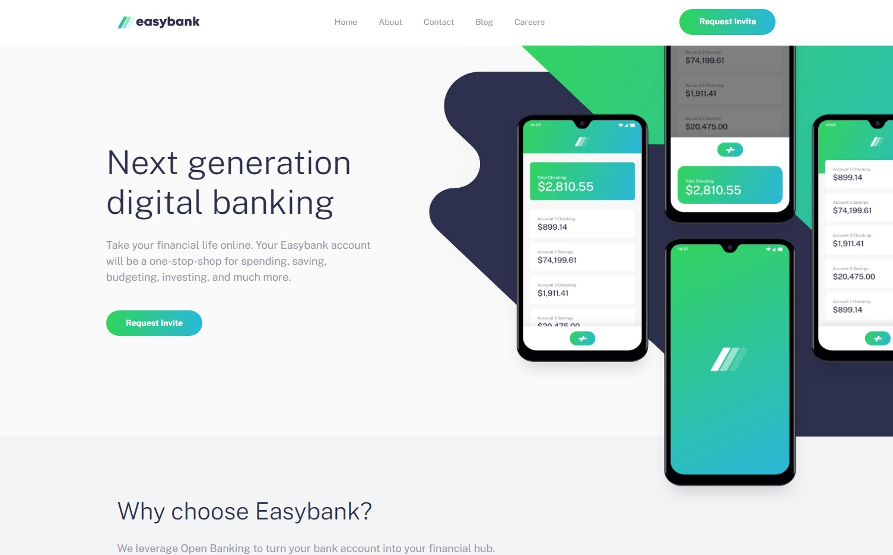

# Frontend Mentor - Easybank landing page solution

This is my solution to the [Easybank landing page challenge on Frontend Mentor](https://www.frontendmentor.io/challenges/easybank-landing-page-WaUhkoDN).

## Table of contents

- [Overview](#overview)
  - [The challenge](#the-challenge)
  - [Screenshot](#screenshot)
  - [Links](#links)
- [My process](#my-process)
  - [Built with](#built-with)
  - [What I learned](#what-i-learned)
  - [Continued development](#continued-development)
  - [Useful resources](#useful-resources)
- [Author](#author)
- [Acknowledgments](#acknowledgments)

## Overview

### The challenge

Users should be able to:

- View the optimal layout for the site depending on their device's screen size
- See hover states for all interactive elements on the page

### Screenshot



### Links

- Solution URL: [https://github.com/daHatta/fem-easybank-landing-page](https://github.com/daHatta/fem-easybank-landing-page)
- Live Site URL: [https://dahatta.github.io/fem-easybank-landing-page](https://dahatta.github.io/fem-easybank-landing-page/)

## My process

### Built with

- Semantic HTML5 markup
- CSS custom properties
- Flexbox
- CSS Grid
- Mobile-first workflow
- Sass
- JavaScript

### What I learned

A great challenge with some difficult tasks in order to implement all features based on the mobile and desktop layout.

In this project I used translate() function to center the mobile menu:

```css
/*...*/
position: fixed;
top: 32%;
transform: translate(-50%, -50%);
width: 327px;
/*...*/
```

Nice hack mentioned by **Kevin Powell** to get a full-width background based on a smaller container:

```css
.profile_bg {
  background-color: $clr-light-grayish-blue;
  box-shadow: 0 0 0 100vmax $clr-light-grayish-blue;
  clip-path: inset(0 -100vmax);
}
```

### Continued development

This challenge was really tough. A great exercise to learn the reading of layouts to find the best markup for the site.
Using different types of containment and finding the correct entry points for background-images were essentiell.
I will definitely add some other challenges of these type.

### Useful resources

- [A Modern Sass Folder Structure](https://dev.to/dostonnabotov/a-modern-sass-folder-structure-330f) - This article by **Technophile** helped me to build up an architecture for sass.
- [Full-width background inside a container](https://www.youtube.com/shorts/81pnuZFarRw) - Great youtube short by **Kevin Powell**.
- [Controlling background-images | CSS Tutorial](https://www.youtube.com/watch?v=3T_Jy1CqH9k) - Dealing with background-images explained by **Kevin Powell**.
- [How to style the parent element when hovering a child element?](https://stackoverflow.com/questions/8114657/how-to-style-the-parent-element-when-hovering-a-child-element) - Stumbled about the pointer-events CSS property via **stack-overflow**.
- [has selector](https://developer.mozilla.org/en-US/docs/Web/CSS/:has) - Great documentation by **Modzilla**.
- [Absolute Centering in CSS](https://medium.com/front-end-weekly/absolute-centering-in-css-ea3a9d0ad72e) - Nice article by **Manisha Basra**.
- [Multiple Navigation Landmarks](https://www.aditus.io/patterns/multiple-navigation-landmarks/) - How to deal with navigation landmarks by **Aditus**.
- [Google Fonts](https://fonts.google.com/specimen/Public+Sans) - Font _Public Sans_ used in this project.

## Author

- Frontend Mentor - [@daHatta](https://www.frontendmentor.io/profile/daHatta)

## Acknowledgments

Special thank you to [@Cheosphere](https://www.frontendmentor.io/profile/Cheosphere). I had some trouble with the hero of this challenge and his [solution](https://www.frontendmentor.io/solutions/easybank-landing-page-7mneoJqNOs) was very helpful to me concerning the desktop layout.
